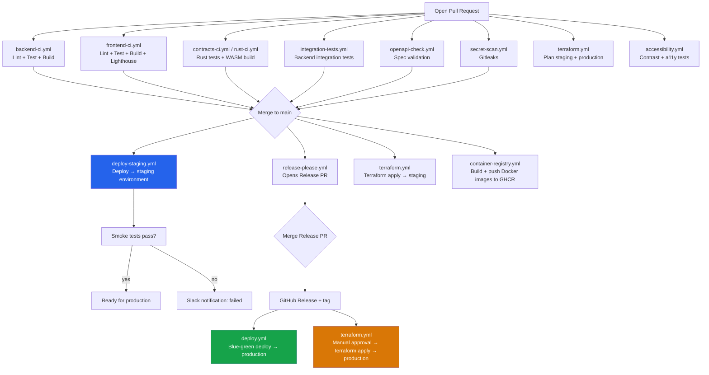

# CI/CD Pipeline Overview

StellarKraal uses GitHub Actions for all continuous integration, delivery, and operations workflows. This document lists every workflow file, its trigger conditions, and its purpose, then shows the release pipeline end-to-end and explains how secrets are managed.

---

## Workflow Summary

All workflow files live in `.github/workflows/`.

### Core CI — run on every PR and push to `main`

| Workflow file | Trigger | Purpose |
|---|---|---|
| `backend-ci.yml` | Push/PR to `main` (paths: `backend/**`) | Install deps, ESLint, TypeScript compile, Jest unit tests, generate and validate Prometheus alert rules |
| `frontend-ci.yml` | Push/PR to `main` (paths: `frontend/**`) | Install deps, contrast audit, type-check, ESLint, Prettier format check, Jest coverage, Next.js build, Lighthouse CI scores |
| `contracts-ci.yml` | Push/PR to `main` | Rust toolchain setup, Soroban contract unit tests, release WASM build, 100 kB WASM size check |
| `rust-ci.yml` | Push/PR to `main` (paths: `contracts/**`) | Soroban contract build + tests (with Cargo cache), `cargo-fuzz` on `interest_rate` for 60 s, uploads crash artifacts on failure |
| `integration-tests.yml` | Push/PR to `main` | Backend Jest integration tests (`*.integration.test.ts`) run in-band with 60 s timeout, annotates PR with failures, uploads coverage |
| `openapi-check.yml` | Push/PR to `main` (paths: routes, services, `openapi.json`) | Validates `backend/openapi.json` with Redocly, checks `info.version` matches `package.json`, probes all spec routes against a live backend instance |

### Deployment

| Workflow file | Trigger | Purpose |
|---|---|---|
| `deploy-staging.yml` | Push to `main` | Runs frontend + backend lint/tests, then deploys to the `staging` GitHub Environment via Docker Compose (`docker-compose.staging.yml`), runs smoke tests, sends Slack notification |
| `deploy.yml` | Push to `main` | Blue-green production deployment: deploys to blue, health-checks, switches traffic, keeps green for 30 min, removes green on success; rolls back to green on failure |

### Infrastructure (Terraform)

| Workflow file | Trigger | Purpose |
|---|---|---|
| `terraform.yml` | PR to `main`/`develop` (paths: `infrastructure/**`) and push to `main` | On PR: fmt-check, init, validate, plan for both `staging` and `production` workspaces, posts plan output as a PR comment. On push to `main`: applies to `staging` automatically, then applies to `production` after manual approval |
| `terraform-check.yml` | PR (paths: `terraform/**`) | Standalone Terraform format and validation check for the `terraform/` directory |

### Security and scanning

| Workflow file | Trigger | Purpose |
|---|---|---|
| `secret-scan.yml` | All pushes and PRs | Runs [Gitleaks](https://github.com/gitleaks/gitleaks) to detect committed secrets; posts PR comment on detection |
| `docker-security-scan.yml` | PR (Dockerfiles/backend/frontend), push to `main`, weekly Sunday midnight | Builds backend and frontend images, runs Trivy for CRITICAL vulnerabilities (fails build), uploads SARIF results to GitHub Security tab |
| `npm-audit.yml` | Weekly Monday 08:00 UTC, manual dispatch | Runs `npm audit --audit-level=high` for both `backend/` and `frontend/`; fails if any high/critical vulnerability is found |

### Quality and accessibility

| Workflow file | Trigger | Purpose |
|---|---|---|
| `accessibility.yml` | Push/PR to `main`/`develop` | Runs contrast audit, Jest accessibility tests, and Playwright `test:a11y`; comments accessibility results on PR |
| `e2e.yml` | Push/PR to `main`/`develop` | Starts Docker Compose test environment, waits for frontend, runs Playwright E2E tests, uploads report artifact |
| `performance-tests.yml` | Push/PR to `main`/`develop`, manual dispatch | Builds backend, starts API server, runs `perf:test` suite, comments p95 latency table on PR |
| `benchmark-comparison.yml` | Push/PR to `main`/`develop` | Runs backend performance benchmarks and uploads comparison results |
| `fuzz.yml` | Push/PR (paths: `contracts/**`) | Runs `cargo-fuzz` on `health_factor`, `loan_request`, `interest_rate`, and `liquidation` targets for 60 s each; uploads crash artifacts on failure |

### Documentation and artefacts

| Workflow file | Trigger | Purpose |
|---|---|---|
| `release-please.yml` | Push to `main` | Runs [release-please](https://github.com/googleapis/release-please) to open a Release PR, bump `package.json` version, update `CHANGELOG.md` from Conventional Commits, and tag a GitHub Release on merge |
| `container-registry.yml` | Push to `main`/`develop`, semver tags, manual dispatch | Builds and pushes backend and frontend Docker images to GHCR with branch, SHA, and semver tags; cleans up images older than 90 days |
| `backend-docs.yml` | Push to `main` | Generates and publishes backend API documentation |
| `rust-docs.yml` | Push to `main` (paths: `contracts/**`) | Runs `cargo doc` and publishes Soroban contract docs to GitHub Pages |

### Operations and validation

| Workflow file | Trigger | Purpose |
|---|---|---|
| `uptime.yml` | Every minute (cron), manual dispatch | Upptime uptime monitoring; writes status to repo, opens GitHub issues, sends Slack/email alerts on downtime |
| `uptime-static.yml` | Push to `main` | Regenerates and deploys the static Upptime status page |
| `db-sync.yml` | Scheduled / manual | Database synchronisation job |
| `validate-env-example.yml` | PR/push (paths: `config.ts`, `.env.example`) | Runs `scripts/validate-env-example.js` to confirm every env var required by `backend/src/config.ts` is present in `.env.example` |

---

## Release Pipeline Flowchart

### Key pipeline properties

- Every PR must pass backend CI, frontend CI, contracts CI, integration tests, OpenAPI validation, and secret scan before merge.
- Staging deploys automatically on every push to `main` — no manual step required.
- Production deployment (`deploy.yml` blue-green) is triggered by push to `main` but uses a blue-green strategy with a 30-minute health observation window.
- Terraform production apply (`terraform.yml`) requires **manual approval** via the `production` GitHub Environment protection rule.
- Releases are fully automated via release-please from Conventional Commits — no manual version bumping.

---

## Required Secrets

### Repository-level secrets (Settings → Secrets and variables → Actions)

| Secret | Used by | Description |
|--------|---------|-------------|
| `AWS_ROLE_TO_ASSUME` | `terraform.yml` | IAM role ARN for OIDC authentication to AWS (no long-lived keys) |
| `LHCI_GITHUB_APP_TOKEN` | `frontend-ci.yml` | Lighthouse CI GitHub App token for score reporting |
| `GH_PAT` | `uptime.yml` | GitHub Personal Access Token for Upptime to write status to the repo |
| `SLACK_WEBHOOK` | `uptime.yml` | Slack webhook for downtime alerts |
| `NOTIFICATION_EMAIL` | `uptime.yml` | Email address for downtime notifications |
| `GITHUB_TOKEN` | Most workflows | Auto-provided by GitHub Actions; used for PR comments, SARIF upload, GHCR login |

### `staging` environment secrets (Settings → Environments → staging)

| Secret | Description |
|--------|-------------|
| `STAGING_RPC_URL` | Soroban testnet RPC endpoint |
| `STAGING_CONTRACT_ID` | Staging Soroban contract deployment ID |
| `STAGING_API_URL` | Staging backend API base URL |
| `STAGING_FRONTEND_URL` | Staging frontend URL (used for CORS) |
| `JWT_SECRET` | JWT signing key for the staging environment |
| `SLACK_WEBHOOK_URL` | Slack webhook for deployment status notifications |

### `production` environment secrets (Settings → Environments → production)

Same set as `staging` but with production values. The `production` environment must also have **required reviewers** configured — this is the manual approval gate that controls when `terraform.yml` applies to production.

### GitHub Variables (Settings → Secrets and variables → Variables)

| Variable | Used by | Description |
|----------|---------|-------------|
| `TF_STATE_BUCKET` | `terraform.yml` | S3 bucket name for Terraform remote state |
| `AWS_REGION` | `terraform.yml` | AWS region (e.g. `us-east-1`) |

---

## Adding a New Secret

1. Go to **Settings → Secrets and variables → Actions** (for repo-level secrets) or **Settings → Environments → \<env\> → Environment secrets** (for environment-scoped secrets).
2. Click **New secret**, enter the name and value, and save.
3. Reference it in the workflow YAML as `${{ secrets.SECRET_NAME }}`.
4. For environment-scoped secrets, add `environment: <env-name>` to the job that needs it.
5. Document the new secret in the table above and in `README.md`.

### OIDC for AWS (no long-lived keys)

`terraform.yml` authenticates to AWS using OpenID Connect rather than static `AWS_ACCESS_KEY_ID` / `AWS_SECRET_ACCESS_KEY` keys. The workflow requests a short-lived token from GitHub's OIDC provider, which AWS trusts via the `AWS_ROLE_TO_ASSUME` IAM role. This is the recommended pattern — do not add static AWS keys as repository secrets.

---

## Further Reading

- [CONTRIBUTING.md](../../CONTRIBUTING.md) — Branch naming, commit convention, and PR process.
- [README.md — Staging Environment](../../README.md#staging-environment) — Staging URLs and secrets reference.
- [docs/observability.md](../observability.md) — Prometheus, Loki, Grafana, and alert rules referenced by `backend-ci.yml`.
- [docs/guides/dependabot.md](dependabot.md) — Dependabot triage process for security PRs raised outside these workflows.
